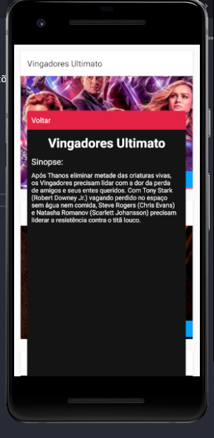

### Biblioteca Axios

 A biblioteca Axios é um cliente HTTP baseado em promises que permite fazer requisições HTTP (GET, POST, PUT, DELETE, etc.) de forma simples e eficiente em JavaScript e Node.js.
 
   instalar: 
  - npm install axios

  

  